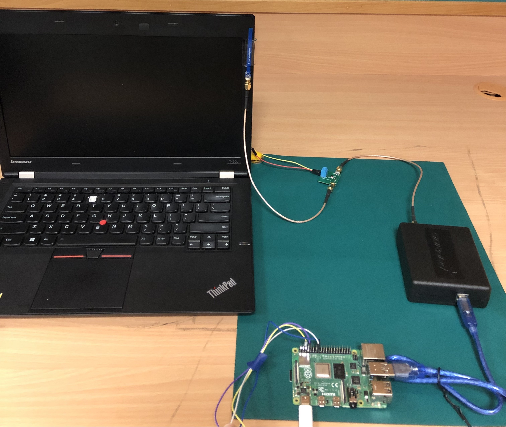

# What is TickTock?
TickTock is an EM-based microphone ON/OFF status detection system, that leverages the change in microphone clock frequency as a proxy for identifying microphone status. 

# Experimental Setup of TickTock

    

TickTock's setup consists of a near-field probe (E-field/H-field), a low noise RF amplifier (connected to 10V DC power supply), SDRPlay RSP-1A Software Defined Radio, and RPi 3B. 

# Contact
* Soundarya Ramesh (<sramesh@comp.nus.edu.sg>) 

